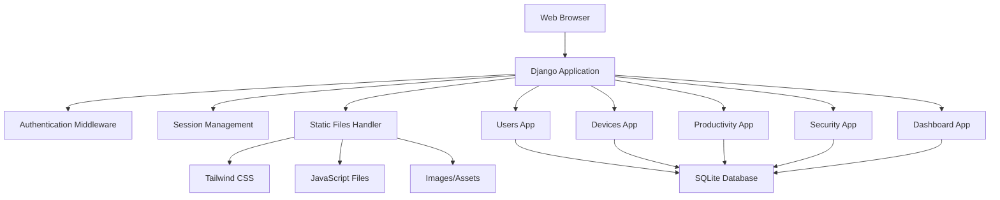
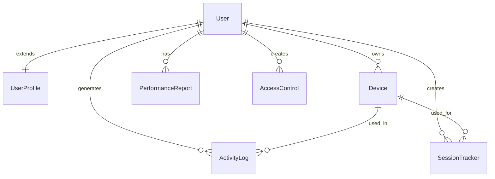

# Design Document

## Overview

The BYOD Security System is built as a Django web application with a modular architecture consisting of five specialized apps. The system uses Django's built-in authentication, SQLite database, and a modern frontend stack with Tailwind CSS and vanilla JavaScript. The design emphasizes security, scalability, and user experience across different roles and devices.

## Architecture

### High-Level Architecture



### App Structure

- **users**: Core authentication, user profiles, and role management
- **devices**: Device registration, compliance tracking, and management
- **productivity**: Activity logging, performance metrics, and reporting
- **security**: Access control rules, session monitoring, and security enforcement
- **dashboard**: Unified interface aggregating data from all apps

## Components and Interfaces

### 1. Users App

**Models:**
- `UserProfile`: Extends Django User model
  - `role`: CharField with choices (teacher, student, admin)
  - `created_at`: DateTimeField
  - `updated_at`: DateTimeField

**Views:**
- `SignupView`: Custom registration with role selection
- `LoginView`: Django's built-in authentication
- `ProfileView`: User profile management and device listing
- `LogoutView`: Session cleanup and redirection

**Forms:**
- `CustomUserCreationForm`: Extends Django's form with role field
- `UserProfileForm`: Profile editing form

### 2. Devices App

**Models:**
- `Device`: Device registration and tracking
  - `name`: CharField (device name)
  - `device_type`: CharField with choices (laptop, tablet, smartphone)
  - `mac_address`: CharField with validation
  - `operating_system`: CharField
  - `compliance_status`: BooleanField
  - `user`: ForeignKey to User
  - `registered_at`: DateTimeField
  - `last_seen`: DateTimeField

**Views:**
- `DeviceListView`: Paginated device listing with filtering
- `DeviceRegisterView`: Device registration form
- `DeviceDetailView`: Individual device information and compliance
- `DeviceUpdateView`: Device information editing

**Forms:**
- `DeviceRegistrationForm`: New device registration
- `DeviceUpdateForm`: Device information updates

### 3. Productivity App

**Models:**
- `ActivityLog`: User activity tracking
  - `user`: ForeignKey to User
  - `device`: ForeignKey to Device
  - `duration`: DurationField
  - `resources_accessed`: TextField (JSON format)
  - `timestamp`: DateTimeField
  - `activity_type`: CharField

- `PerformanceReport`: Aggregated performance metrics
  - `user`: ForeignKey to User
  - `productivity_score`: FloatField
  - `attendance_percentage`: FloatField
  - `report_date`: DateField
  - `generated_at`: DateTimeField

**Views:**
- `ActivityLogListView`: Paginated activity logs with filtering
- `ReportsView`: Performance report generation and display
- `ExportCSVView`: Data export functionality

### 4. Security App

**Models:**
- `AccessControl`: Role-based access rules
  - `role`: CharField
  - `allowed_domains`: TextField (JSON format)
  - `blocked_domains`: TextField (JSON format)
  - `time_restrictions`: TextField (JSON format)
  - `created_by`: ForeignKey to User
  - `is_active`: BooleanField

- `SessionTracker`: Session monitoring
  - `user`: ForeignKey to User
  - `device`: ForeignKey to Device
  - `login_time`: DateTimeField
  - `logout_time`: DateTimeField (nullable)
  - `ip_address`: GenericIPAddressField
  - `status`: CharField with choices
  - `session_key`: CharField

**Views:**
- `AccessRulesView`: Access control configuration (admin only)
- `SessionMonitorView`: Live session monitoring
- `SecurityAlertsView`: Security event notifications

**Middleware:**
- `SessionValidationMiddleware`: Custom middleware for session tracking
- `AccessControlMiddleware`: Enforce access restrictions

### 5. Dashboard App

**Views:**
- `DashboardView`: Role-based dashboard with aggregated metrics
- `StatsAPIView`: JSON endpoint for real-time data updates

**Dashboard Components:**
- Device compliance overview
- Active session counts
- Productivity metrics summary
- Recent security alerts
- Quick action buttons

## Data Models

### Entity Relationship Diagram



### Key Relationships

- **User to UserProfile**: One-to-one extension of Django's User model
- **User to Device**: One-to-many (users can register multiple devices)
- **User to ActivityLog**: One-to-many (users generate multiple activity records)
- **Device to ActivityLog**: One-to-many (devices can be used in multiple activities)
- **User to SessionTracker**: One-to-many (users can have multiple sessions)

## Error Handling

### Validation Strategy

- **Form Validation**: Django forms with custom validators for MAC addresses, role permissions
- **Model Validation**: Database-level constraints and custom model validation methods
- **View Validation**: Permission checks and data sanitization in views
- **Frontend Validation**: JavaScript validation for immediate user feedback

### Error Response Patterns

- **Authentication Errors**: Redirect to login with appropriate messages
- **Permission Errors**: 403 pages with role-specific guidance
- **Validation Errors**: Form redisplay with field-specific error messages
- **System Errors**: Custom 500 pages with user-friendly messages

### Security Error Handling

- **Session Timeout**: Automatic logout with notification
- **Access Violations**: Logging and admin notifications
- **Invalid Device Registration**: Detailed validation feedback
- **CSRF Failures**: Clear error messages and form refresh

## Testing Strategy

### Unit Testing

- **Model Tests**: Validation, relationships, and custom methods
- **Form Tests**: Field validation and custom form logic
- **View Tests**: Authentication, permissions, and response content
- **Utility Tests**: Custom validators and helper functions

### Integration Testing

- **Authentication Flow**: Complete login/logout/registration process
- **Device Management**: Registration, compliance checking, and updates
- **Activity Tracking**: Log creation and report generation
- **Dashboard Integration**: Data aggregation and display

### Frontend Testing

- **JavaScript Functionality**: Theme switching, modal interactions, form validation
- **Responsive Design**: Cross-device and cross-browser compatibility
- **Accessibility**: Screen reader compatibility and keyboard navigation

### Security Testing

- **Session Management**: Timeout handling and concurrent session prevention
- **Access Control**: Role-based permission enforcement
- **Input Validation**: SQL injection and XSS prevention
- **CSRF Protection**: Form submission security

## Frontend Architecture

### Template Structure

```
templates/
├── base.html (main layout with navigation)
├── includes/
│   ├── navbar.html
│   ├── sidebar.html
│   ├── messages.html
│   └── pagination.html
├── users/ (authentication templates)
├── devices/ (device management templates)
├── productivity/ (activity and reports templates)
├── security/ (access control templates)
└── dashboard/ (dashboard templates)
```

### CSS Architecture

- **Tailwind CSS**: Utility-first framework for rapid UI development
- **Component Classes**: Reusable component styles following ShadCN design patterns
- **Theme System**: CSS custom properties for dark/light mode switching
- **Responsive Design**: Mobile-first approach with breakpoint-specific styles

### JavaScript Architecture

- **main.js**: Central JavaScript file for all interactive behaviors
- **Module Pattern**: Organized code with clear separation of concerns
- **Event Delegation**: Efficient event handling for dynamic content
- **Theme Management**: Local storage-based theme persistence
- **Modal System**: Reusable modal components for confirmations and forms

### UI Components

- **Cards**: Information display with consistent styling
- **Forms**: Tailwind-styled form elements with validation feedback
- **Tables**: Responsive data tables with sorting and filtering
- **Navigation**: Sidebar and navbar with active state management
- **Modals**: Overlay dialogs for confirmations and detailed views
- **Alerts**: Message display system for success/error feedback

## Security Implementation

### Authentication & Authorization

- **Django Authentication**: Built-in user authentication system
- **Role-Based Access**: Custom decorators and mixins for view protection
- **Session Security**: Secure cookie configuration and timeout handling
- **Password Security**: Django's built-in password validation and hashing

### Data Protection

- **Input Sanitization**: Form validation and data cleaning
- **SQL Injection Prevention**: Django ORM usage and parameterized queries
- **XSS Protection**: Template auto-escaping and CSP headers
- **CSRF Protection**: Django's built-in CSRF middleware

### Session Management

- **Session Tracking**: Custom middleware for activity monitoring
- **Concurrent Session Control**: Prevention of multiple active sessions
- **Automatic Logout**: Inactivity-based session termination
- **Secure Cookies**: HTTPOnly and Secure flags for session cookies

## Performance Considerations

### Database Optimization

- **Query Optimization**: Use of select_related and prefetch_related
- **Indexing Strategy**: Database indexes on frequently queried fields
- **Pagination**: Efficient pagination for large datasets
- **Caching**: Django's caching framework for frequently accessed data

### Frontend Performance

- **Static File Optimization**: Minified CSS and JavaScript
- **Image Optimization**: Compressed images and appropriate formats
- **Lazy Loading**: Deferred loading of non-critical content
- **CDN Integration**: Static file delivery optimization

### Scalability Planning

- **Database Migration Path**: SQLite to PostgreSQL migration strategy
- **Caching Layer**: Redis integration for session storage and caching
- **Load Balancing**: Application server scaling considerations
- **Monitoring**: Performance monitoring and alerting setup