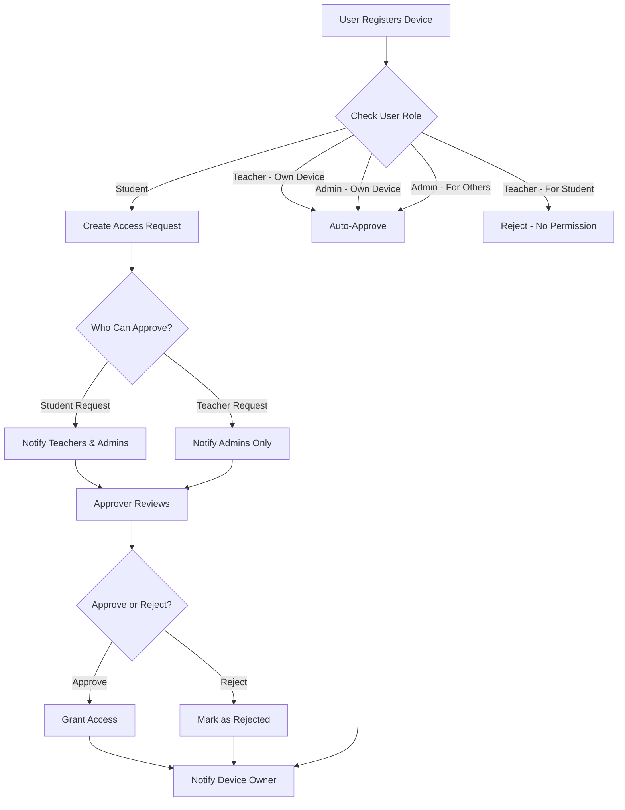
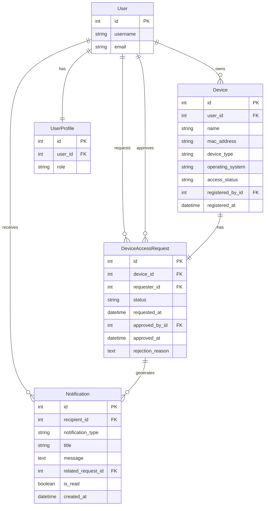

# Design Document: Role-Based Device Access Request System

## Overview

This design document outlines the implementation of a hierarchical device access request and approval system for the BYOD Security platform. The system introduces an approval workflow where device registration requests are routed to appropriate approvers based on user roles, with different capabilities for Students, Teachers, and Admins.

### Key Design Principles

1. **Role-Based Hierarchy**: Students → Teachers/Admins → Admins (escalating authority)
2. **Separation of Concerns**: Clear distinction between device registration and access approval
3. **Audit Trail**: Complete tracking of all registration and approval actions
4. **Notification System**: Real-time notifications for pending requests
5. **Security First**: Enforce permissions at model, view, and template levels

## Architecture

### High-Level Architecture

```
┌─────────────────────────────────────────────────────────────┐
│                     Presentation Layer                       │
│  ┌──────────────┐  ┌──────────────┐  ┌──────────────┐      │
│  │   Student    │  │   Teacher    │  │    Admin     │      │
│  │  Dashboard   │  │  Dashboard   │  │  Dashboard   │      │
│  └──────────────┘  └──────────────┘  └──────────────┘      │
└─────────────────────────────────────────────────────────────┘
                            │
┌─────────────────────────────────────────────────────────────┐
│                      Business Logic Layer                    │
│  ┌──────────────────────────────────────────────────────┐   │
│  │         Device Access Request Manager                │   │
│  │  - Role validation                                   │   │
│  │  - Approval routing                                  │   │
│  │  - Auto-approval logic                               │   │
│  └──────────────────────────────────────────────────────┘   │
│  ┌──────────────────────────────────────────────────────┐   │
│  │         Notification Service                         │   │
│  │  - Request notifications                             │   │
│  │  - Approval notifications                            │   │
│  │  - Badge counts                                      │   │
│  └──────────────────────────────────────────────────────┘   │
└─────────────────────────────────────────────────────────────┘
                            │
┌─────────────────────────────────────────────────────────────┐
│                        Data Layer                            │
│  ┌──────────────┐  ┌──────────────┐  ┌──────────────┐      │
│  │   Device     │  │AccessRequest │  │ Notification │      │
│  │    Model     │  │    Model     │  │    Model     │      │
│  └──────────────┘  └──────────────┘  └──────────────┘      │
└─────────────────────────────────────────────────────────────┘
```

### Request Flow Diagram



## Components and Interfaces

### 1. DeviceAccessRequest Model

**Purpose**: Track device access requests and their approval status.

**Fields**:
```python
class DeviceAccessRequest(models.Model):
    STATUS_CHOICES = [
        ('pending', 'Pending'),
        ('approved', 'Approved'),
        ('rejected', 'Rejected'),
    ]
    
    device = ForeignKey(Device)              # The device requesting access
    requester = ForeignKey(User)             # User who registered the device
    status = CharField(choices=STATUS_CHOICES, default='pending')
    requested_at = DateTimeField(auto_now_add=True)
    
    # Approval tracking
    approved_by = ForeignKey(User, null=True, blank=True)
    approved_at = DateTimeField(null=True, blank=True)
    rejection_reason = TextField(blank=True)
    
    # Metadata
    notes = TextField(blank=True)
```

**Methods**:
- `approve(approver, notes='')`: Approve the request and grant device access
- `reject(approver, reason='')`: Reject the request
- `can_be_approved_by(user)`: Check if user has permission to approve
- `get_eligible_approvers()`: Return queryset of users who can approve

### 2. Notification Model

**Purpose**: Store and manage user notifications for access requests.

**Fields**:
```python
class Notification(models.Model):
    NOTIFICATION_TYPES = [
        ('access_request', 'Device Access Request'),
        ('request_approved', 'Request Approved'),
        ('request_rejected', 'Request Rejected'),
    ]
    
    recipient = ForeignKey(User)
    notification_type = CharField(choices=NOTIFICATION_TYPES)
    title = CharField(max_length=200)
    message = TextField()
    related_request = ForeignKey(DeviceAccessRequest, null=True)
    
    is_read = BooleanField(default=False)
    created_at = DateTimeField(auto_now_add=True)
```

**Methods**:
- `mark_as_read()`: Mark notification as read
- `get_unread_count(user)`: Class method to get unread count for user

### 3. Device Model Extensions

**New Fields**:
```python
# Add to existing Device model
access_status = CharField(
    max_length=20,
    choices=[
        ('pending', 'Pending Approval'),
        ('active', 'Active'),
        ('rejected', 'Rejected'),
        ('suspended', 'Suspended'),
    ],
    default='pending'
)
registered_by = ForeignKey(User, related_name='registered_devices')
```

**New Methods**:
- `grant_access()`: Change status to 'active'
- `revoke_access()`: Change status to 'suspended'
- `requires_approval()`: Check if device needs approval based on registration context

### 4. Access Request Manager Service

**Purpose**: Centralized business logic for handling device access requests.

**Location**: `devices/services/access_request_manager.py`

**Key Methods**:

```python
class AccessRequestManager:
    @staticmethod
    def create_request(device, requester):
        """
        Create access request and handle auto-approval logic.
        Returns: (request, was_auto_approved)
        """
        
    @staticmethod
    def get_eligible_approvers(request):
        """
        Return users who can approve this request based on requester role.
        """
        
    @staticmethod
    def approve_request(request, approver, notes=''):
        """
        Approve request, grant device access, send notifications.
        """
        
    @staticmethod
    def reject_request(request, approver, reason=''):
        """
        Reject request and notify requester.
        """
        
    @staticmethod
    def should_auto_approve(device, requester, registered_by):
        """
        Determine if device should be auto-approved based on roles.
        Rules:
        - Teacher registering own device: auto-approve
        - Admin registering any device: auto-approve
        - Student registering device: requires approval
        - Teacher registering for student: not allowed
        """
```

### 5. Notification Service

**Purpose**: Handle creation and delivery of notifications.

**Location**: `devices/services/notification_service.py`

**Key Methods**:

```python
class NotificationService:
    @staticmethod
    def notify_access_request(request):
        """
        Send notifications to eligible approvers when request is created.
        """
        
    @staticmethod
    def notify_request_approved(request):
        """
        Notify device owner when request is approved.
        """
        
    @staticmethod
    def notify_request_rejected(request, reason):
        """
        Notify device owner when request is rejected.
        """
        
    @staticmethod
    def get_unread_count(user):
        """
        Get count of unread notifications for user.
        """
```

### 6. Views and URLs

**New Views**:

1. **DeviceRegisterView** (Modified)
   - Add role-based logic for device registration
   - Handle target user selection for admins
   - Create access request or auto-approve based on rules

2. **AccessRequestListView**
   - Display pending requests for approvers
   - Filter by requester role
   - Paginated list with device details

3. **AccessRequestApproveView**
   - Handle approval action
   - Validate approver permissions
   - Add optional notes

4. **AccessRequestRejectView**
   - Handle rejection action
   - Require rejection reason
   - Validate approver permissions

5. **NotificationListView**
   - Display user notifications
   - Mark as read functionality
   - Filter by type

6. **NotificationBadgeView** (AJAX)
   - Return unread notification count
   - Used for real-time badge updates

**URL Structure**:
```
/devices/
    register/                          # Device registration
    access-requests/                   # List pending requests (approvers)
    access-requests/<id>/approve/      # Approve request
    access-requests/<id>/reject/       # Reject request
    my-requests/                       # User's own requests status

/notifications/
    list/                              # All notifications
    unread-count/                      # AJAX endpoint for badge
    mark-read/<id>/                    # Mark notification as read
```

### 7. Forms

**DeviceRegistrationForm** (Modified):
```python
class DeviceRegistrationForm(forms.ModelForm):
    # For admins only - select target user
    target_user = forms.ModelChoiceField(
        queryset=User.objects.all(),
        required=False,
        help_text="Admin: Select user to register device for"
    )
    
    def __init__(self, *args, user=None, **kwargs):
        super().__init__(*args, **kwargs)
        self.user = user
        
        # Show target_user field only for admins
        if not user.profile.is_admin:
            self.fields.pop('target_user')
    
    def clean(self):
        # Validate role-based permissions
        # Teachers cannot register for students
        # Students can only register for themselves
```

**AccessRequestApprovalForm**:
```python
class AccessRequestApprovalForm(forms.Form):
    notes = forms.CharField(
        widget=forms.Textarea,
        required=False,
        help_text="Optional notes about the approval"
    )
```

**AccessRequestRejectionForm**:
```python
class AccessRequestRejectionForm(forms.Form):
    reason = forms.CharField(
        widget=forms.Textarea,
        required=True,
        help_text="Please provide a reason for rejection"
    )
```

## Data Models

### Entity Relationship Diagram



### Database Indexes

For optimal query performance:

```python
class DeviceAccessRequest(models.Model):
    class Meta:
        indexes = [
            models.Index(fields=['status', 'requested_at']),
            models.Index(fields=['requester', 'status']),
            models.Index(fields=['device']),
        ]

class Notification(models.Model):
    class Meta:
        indexes = [
            models.Index(fields=['recipient', 'is_read', 'created_at']),
            models.Index(fields=['related_request']),
        ]
```

## Error Handling

### Permission Errors

**Scenario**: User attempts unauthorized action
- **Response**: HTTP 403 Forbidden
- **Message**: "You don't have permission to perform this action"
- **Logging**: Log attempt with user ID and action

### Validation Errors

**Scenario**: Teacher tries to register device for student
- **Response**: Form validation error
- **Message**: "Teachers cannot register devices for students"
- **Action**: Display error on form

**Scenario**: Student tries to approve own request
- **Response**: HTTP 403 Forbidden
- **Message**: "You cannot approve your own device access request"

### Business Logic Errors

**Scenario**: Attempt to approve already-approved request
- **Response**: Redirect with warning message
- **Message**: "This request has already been approved"

**Scenario**: Device with duplicate MAC address
- **Response**: Form validation error
- **Message**: "A device with this MAC address is already registered"

### Error Logging

All permission violations and business logic errors should be logged:

```python
import logging
logger = logging.getLogger('devices.access_requests')

logger.warning(
    f"Unauthorized approval attempt: User {user.id} tried to approve "
    f"request {request.id} without permission"
)
```

## Testing Strategy

### Unit Tests

**Model Tests** (`tests/test_models.py`):
- DeviceAccessRequest creation and state transitions
- Permission checking methods (`can_be_approved_by`)
- Auto-approval logic validation
- Notification creation

**Service Tests** (`tests/test_services.py`):
- AccessRequestManager.create_request() with different roles
- AccessRequestManager.should_auto_approve() logic
- NotificationService notification creation
- Eligible approver selection logic

### Integration Tests

**View Tests** (`tests/test_views.py`):
- Device registration flow for each role
- Access request approval workflow
- Permission enforcement in views
- Notification delivery

**Form Tests** (`tests/test_forms.py`):
- DeviceRegistrationForm validation for each role
- Target user field visibility for admins
- Approval/rejection form validation

### Test Scenarios

1. **Student Registration Flow**:
   - Student registers device
   - Access request created with 'pending' status
   - Teachers and admins receive notifications
   - Teacher approves request
   - Device status changes to 'active'
   - Student receives approval notification

2. **Teacher Self-Registration**:
   - Teacher registers own device
   - Device auto-approved (no access request created)
   - Device status immediately 'active'

3. **Admin Registration for Others**:
   - Admin registers device for student
   - Device auto-approved
   - Student can immediately use device

4. **Permission Violations**:
   - Teacher attempts to register for student → Rejected
   - Student attempts to approve own request → Rejected
   - Teacher attempts to approve another teacher's request → Rejected

### Test Data Fixtures

Create fixtures for:
- Users with different roles (student, teacher, admin)
- Devices in various states (pending, active, rejected)
- Access requests in different statuses
- Notifications (read/unread)

## Security Considerations

### Permission Enforcement Layers

1. **View Level**: Use decorators and mixins
   ```python
   @login_required
   @user_passes_test(lambda u: u.profile.is_teacher or u.profile.is_admin)
   def access_request_list(request):
       ...
   ```

2. **Model Level**: Validate in model methods
   ```python
   def approve(self, approver):
       if not self.can_be_approved_by(approver):
           raise PermissionDenied("You cannot approve this request")
   ```

3. **Template Level**: Hide UI elements
   ```django
   
       <a href="">Pending Requests</a>
   
   ```

### Audit Trail

Log all critical actions:
- Device registrations (who, when, for whom)
- Access request approvals/rejections (who approved, when)
- Permission violations
- Status changes

### Data Validation

- Validate MAC address uniqueness across all devices
- Ensure device owner matches requester (except for admin registrations)
- Validate approver has appropriate role
- Prevent duplicate approvals

## UI/UX Design

### Dashboard Widgets

**Student Dashboard**:
- My Devices (with status badges)
- Pending Requests (with status and estimated approval time)
- Recent Notifications

**Teacher Dashboard**:
- My Devices
- Pending Student Requests (count badge)
- Recent Approvals
- Quick Approve Actions

**Admin Dashboard**:
- All Pending Requests (students + teachers)
- System Statistics
- Recent Activity Log
- Quick Actions (register device for user)

### Notification Badge

Display unread count in navigation:
```html
<a href="">
    Notifications
    <span class="badge">{{ unread_count }}</span>
</a>
```

Update via AJAX every 30 seconds:
```javascript
setInterval(updateNotificationBadge, 30000);
```

### Access Request Card Design

```
┌─────────────────────────────────────────────────┐
│ 📱 Device Name                          [PENDING]│
│ Student: John Doe                                │
│ Type: Smartphone | OS: Android                   │
│ MAC: AA:BB:CC:DD:EE:FF                          │
│ Requested: 2 hours ago                           │
│                                                  │
│ [Approve] [Reject] [View Details]               │
└─────────────────────────────────────────────────┘
```

### Status Indicators

- **Pending**: Yellow badge with clock icon
- **Approved**: Green badge with checkmark
- **Rejected**: Red badge with X icon
- **Active**: Blue badge with shield icon

## Implementation Notes

### Migration Strategy

1. Create new models (DeviceAccessRequest, Notification)
2. Add new fields to Device model
3. Create indexes
4. Migrate existing devices to 'active' status
5. Backfill registered_by field with device owner

### Backward Compatibility

- Existing devices should be marked as 'active' automatically
- No access requests needed for pre-existing devices
- registered_by defaults to device owner for existing devices

### Performance Considerations

- Use select_related() for device queries with user data
- Prefetch notifications when loading dashboard
- Cache unread notification counts (Redis recommended)
- Paginate access request lists
- Index frequently queried fields

### Future Enhancements

- Email notifications for access requests
- Bulk approval actions
- Request expiration (auto-reject after X days)
- Approval delegation
- Request comments/discussion thread
- Mobile push notifications
- Approval workflow customization per organization
