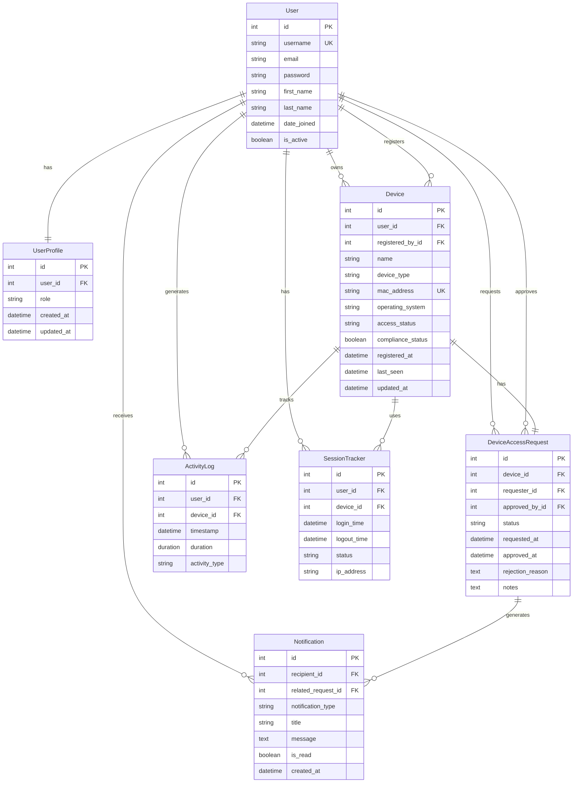
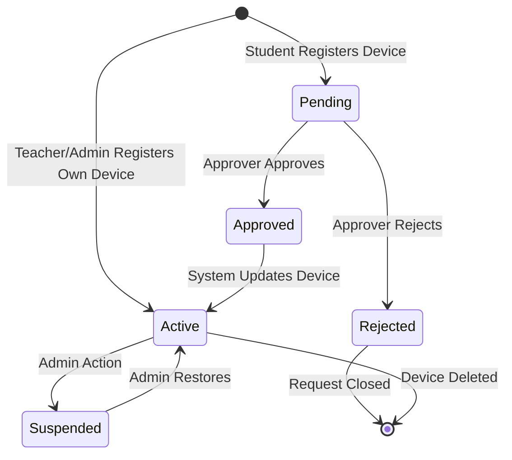
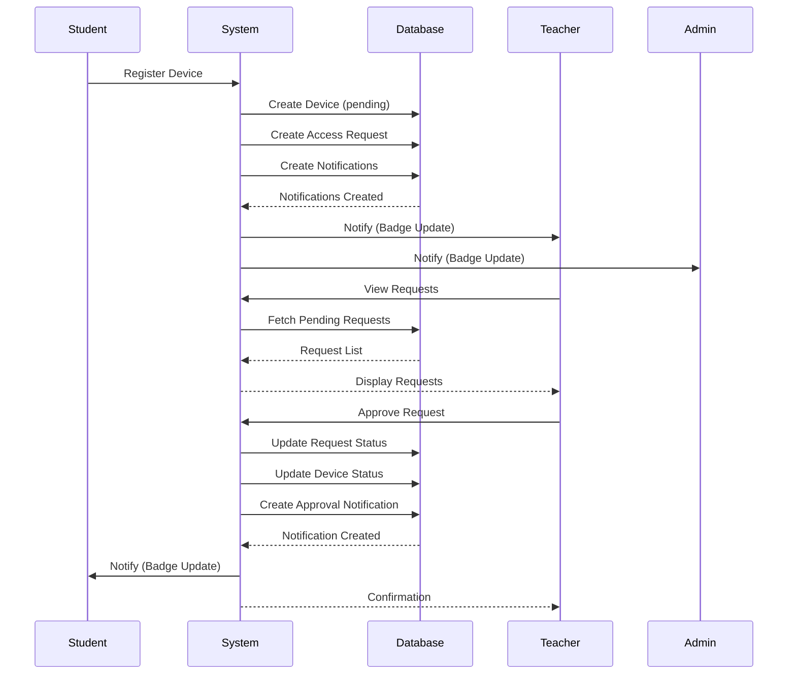

# Software Requirements Specification (SRS)
# BYOD Security System

**Version:** 1.0  
**Date:** November 13, 2025  
**Prepared by:** Development Team  
**Project:** Bring Your Own Device (BYOD) Security Management System

---

## Table of Contents

1. [Introduction](#1-introduction)
2. [General Description](#2-general-description)
3. [Specific Requirements](#3-specific-requirements)
4. [Analysis Models](#4-analysis-models)
5. [Appendices](#5-appendices)

---

## Revision History

| Version | Date | Description | Author |
|---------|------|-------------|--------|
| 1.0 | November 13, 2025 | Initial SRS Document | Development Team |

---

## 1. Introduction

### 1.1 Purpose

This Software Requirements Specification document provides a comprehensive description of the BYOD (Bring Your Own Device) Security System, defining both functional and non-functional requirements to establish clear understanding between stakeholders and the development team. The document serves as a foundation for project planning, design, testing, and future maintenance activities. The intended audience includes project stakeholders, system developers, quality assurance teams, system administrators, and end users comprising students, teachers, and administrators.

### 1.2 Scope

The BYOD Security System is a web-based application designed to manage and secure personal devices within an educational institution's network environment. The system provides comprehensive device registration and access request management with role-based approval workflows, enabling students to register devices that require approval from teachers or administrators, while teachers and administrators enjoy auto-approval privileges for their own devices. Core capabilities include real-time notification systems for access requests, device compliance monitoring and tracking, activity logging with productivity reporting, and security access control with session management.

The system delivers significant benefits including enhanced network security through controlled device access, streamlined approval processes, improved visibility of device usage and compliance, reduced administrative overhead, and better user experience through automated notifications. However, the scope explicitly excludes physical device security measures, device repair or technical support services, network infrastructure management, third-party mobile device management integration, and native mobile application development.


### 1.3 Definitions, Acronyms, and Abbreviations

BYOD refers to Bring Your Own Device, a policy allowing personal devices on institutional networks. MAC Address is the Media Access Control Address serving as a unique identifier for network interfaces. An Access Request represents a pending request for device network access approval, while an Approver is a teacher or admin authorized to approve such requests. Compliance Status indicates whether a device meets security requirements. The system uses Role-Based Access Control (RBAC) to restrict access based on user roles, and maintains Session tracking for periods of active network connection.

### 1.4 References

This document references Django Framework Documentation (https://docs.djangoproject.com/), Tailwind CSS Documentation (https://tailwindcss.com/docs), IEEE Std 830-1998 for Software Requirements Specifications, OWASP Security Guidelines (https://owasp.org/), and the internal project repository.

### 1.5 Overview

This SRS document is organized into five main sections. Section 2 provides a general description of the system including its perspective, functions, user characteristics, and constraints. Section 3 details specific functional and non-functional requirements covering all system capabilities. Section 4 presents analysis models including system architecture, data flow diagrams, and database schema. Section 5 contains appendices with supplementary information including glossaries, use cases, and technical specifications.

---

## 2. General Description

### 2.1 Product Perspective

The BYOD Security System operates as a standalone web application built on the Django framework, functioning within an educational institution's IT infrastructure. The system interfaces with users through modern web browsers, maintains data persistence through a SQLite database (upgradeable to PostgreSQL for production), and implements a role-based access control architecture. As a self-contained system with minimal external dependencies, it provides responsive design supporting desktop, tablet, and mobile devices while requiring only standard web server infrastructure for deployment.

```
┌────────────────────────────────────────────────┐
│              Educational Institution           │
│                                                │
│  ┌────────────┐      ┌──────────────────┐      │
│  │   Users    │◄────►│  BYOD Security   │      │
│  │ (Browser)  │      │     System       │      │
│  └────────────┘      └──────────────────┘      │
│                              │                 │
│                              ▼                 │
│                      ┌──────────────┐          │
│                      │   Database   │          │
│                      │  (SQLite)    │          │
│                      └──────────────┘          │
└────────────────────────────────────────────────┘
```

### 2.2 Product Functions

The system delivers seven major functional areas that work together to provide comprehensive device management. User Management handles authentication, authorization, and role-based access control for students, teachers, and administrators. Device Management enables device registration with MAC address validation, compliance tracking, and complete lifecycle management including registration, updates, and deletion. Access Request Management implements role-based workflows with automated approval for privileged users and manual approval processes for students, along with comprehensive request tracking and status monitoring.

The Notification System provides real-time notifications for access requests, displays notification badges with unread counts, and maintains an email-style notification center for user convenience. Activity Monitoring tracks device activity, monitors sessions, and generates productivity reports. Security and Access Control manages access rules, monitors sessions in real-time, and maintains a security alert system. Finally, Dashboard and Reporting provides role-specific dashboards with device statistics, analytics, and compliance reporting tailored to each user type.


### 2.3 User Characteristics

The system serves three distinct user roles with varying technical expertise and responsibilities. Students possess basic to intermediate computer skills and primarily use the system to register personal devices and track approval status. They have limited access restricted to managing their own devices and use the system occasionally for device registration and status checks. Teachers demonstrate intermediate computer skills and regularly use the system to approve student device requests, manage their own devices, and monitor student activity. They possess moderate access levels allowing them to approve student requests and access reports, engaging with the system daily for monitoring and approval tasks.

Administrators represent the most technically proficient user group with advanced computer and system administration skills. They perform comprehensive system management including approving all requests and configuring security rules. With full system access and control, administrators use the system frequently for continuous monitoring and management activities, ensuring smooth operation and security compliance across the institution.

### 2.4 General Constraints

The system operates under several technical, regulatory, and business constraints that shape its design and implementation. Technical constraints require the system to run on standard web servers with Python 3.8+ support, utilize SQLite for development (upgradeable to PostgreSQL or MySQL for production), and maintain compatibility with modern browsers including Chrome 90+, Firefox 88+, Safari 14+, and Edge 90+. The system enforces a maximum file upload size of 10MB and implements a 30-minute session timeout for inactive users.

Regulatory constraints mandate compliance with data privacy regulations including GDPR and FERPA, requiring encryption of user data in transit through HTTPS, maintenance of audit logs for security events, and adherence to institutional password policy standards. Business constraints limit development to open-source technologies only, eliminating licensing costs for third-party software while ensuring deployability on existing institutional infrastructure. The system must support up to 10,000 concurrent users without performance degradation.

### 2.5 Assumptions and Dependencies

The system's successful operation relies on several key assumptions and dependencies. We assume users have access to modern web browsers, the institution maintains stable internet connectivity, users possess valid email addresses for notifications, devices have unique MAC addresses, users understand basic device network settings, and the institution provides IT support for system deployment.

Critical dependencies include Django Framework version 4.2 or higher, Python 3.8 or higher, Tailwind CSS for UI styling, SQLite for development or PostgreSQL for production environments, web server infrastructure using Apache or Nginx, and an SMTP server for email notifications. These dependencies form the foundation upon which the system operates and must be properly configured and maintained for optimal performance.

---

## 3. Specific Requirements

### 3.1 External Interface Requirements

The system interfaces with users through multiple carefully designed interfaces. The Login Interface provides secure authentication with username and password inputs, featuring a remember me option, password reset link, and clear error messaging. Upon successful authentication, users access role-specific Dashboard Interfaces that adapt responsively to desktop, tablet, and mobile screens, displaying navigation sidebars with role-based menu items, statistics cards showing device counts and pending requests, recent activity feeds, quick action buttons, and notification badges.

The Device Registration Form enables users to register new devices through a comprehensive interface accepting device name, type, operating system, and MAC address with real-time validation and contextual help text. For administrators, an additional target user dropdown allows device registration on behalf of other users. The Access Request Management interface provides approvers with filterable lists of pending requests, detailed device information displays, approve and reject action buttons, status badges indicating pending, approved, or rejected states, and pagination for managing large request volumes. The Notification Center centralizes notification management with lists showing read and unread status, mark as read functionality, notification type icons, timestamps, and links to related requests.


Hardware interfaces remain minimal, requiring only standard Ethernet or Wi-Fi connections without special hardware beyond standard server infrastructure. Software interfaces include Django ORM for database operations supporting CRUD operations on all data models through persistent connection pools, web server interfaces using HTTP/HTTPS protocols on ports 80 and 443 with Apache or Nginx and WSGI, and email service interfaces using SMTP for notification delivery with configurable server settings. Communication interfaces utilize HTTP/HTTPS protocols for all client-server communication, implementing RESTful API endpoints for AJAX requests with JSON data format for API responses, with future enhancement plans for WebSocket support enabling real-time notification updates and live dashboard statistics.

### 3.2 Functional Requirements

User authentication and authorization form the foundation of system security. Users must authenticate using username and password credentials, with the system validating credentials against the database, creating sessions upon successful authentication, and redirecting users to role-appropriate dashboards. The system enforces role-based access control with three distinct roles: students having limited access to own devices and requests, teachers accessing student requests and reports, and administrators enjoying full system access. Users can securely log out, with the system destroying sessions, clearing authentication cookies, and redirecting to the login page.

Device management capabilities enable comprehensive device lifecycle control. Users register devices by providing device name, type, operating system, MAC address, and for administrators, an optional target user. The system validates all inputs, checks MAC address uniqueness, normalizes MAC address format, creates device records, determines approval requirements based on user roles, creates access requests when needed, and sends notifications to appropriate approvers. Business rules dictate that student devices require approval, teacher-owned devices receive auto-approval, and administrator-registered devices are auto-approved regardless of target user. Users can view their registered devices through paginated lists with search functionality, filtering by device type, operating system, compliance status, and access status, with sorting by registration date. Device updates allow modification of device information with the same validation as registration, noting that MAC address changes reset compliance status. Users can delete devices after confirmation, with the system logging deletion actions.

Access request management implements sophisticated workflow automation. The system automatically creates access requests when students register devices, identifying eligible approvers based on requester roles and sending notifications to all eligible approvers. Teachers and administrators view pending access requests filtered by their role, with teachers seeing only student requests and administrators viewing all requests including those from teachers. Approvers can approve requests by providing optional notes, with the system validating approver permissions, updating request status to approved, activating devices, recording approver and timestamp information, and notifying requesters. Similarly, approvers can reject requests by providing mandatory rejection reasons, with the system updating request status to rejected, setting device status accordingly, and notifying requesters with the rejection reason. Users track their own access requests through dedicated interfaces showing device details, request status, dates, approver information, and approval or rejection notes, along with statistics counting pending, approved, and rejected requests.

The notification system ensures timely communication of important events. The system creates notifications for access request submissions to approvers, request approvals to requesters, and request rejections to requesters. Users view notifications through comprehensive lists showing newest items first, with visual distinction for unread notifications, type-specific icons, relative timestamps, and links to related requests. Notification badges display unread counts in navigation with real-time updates via AJAX, auto-refreshing every 30 seconds and hiding when counts reach zero. Users mark notifications as read individually or in bulk, with the system updating read status and reflecting changes in the user interface.

Dashboard and reporting capabilities provide role-specific insights. Student dashboards display device statistics including total, compliant, and pending counts, recent activity logs, pending access requests, recent sessions, and weekly activity charts, all limited to user-specific information. Teacher dashboards show student statistics, device compliance rates, pending student access requests with quick action buttons, recent student activity, top performing students, and average productivity metrics, aggregating data across all students. Administrator dashboards present comprehensive system-wide statistics including user counts, device counts, session information, all pending access requests, device compliance overviews, security violations, recent registrations, active session counts, and system health metrics.


Activity and productivity tracking enable comprehensive monitoring capabilities. The system logs device activity including user ID, device ID, timestamps, duration, and activity type, with teachers and administrators able to view student activity. Session tracking monitors device network sessions recording user and device information, login and logout times, session duration, and session status including active, completed, or violation states, supporting real-time active session monitoring. Performance reports generate productivity metrics for students including activity hours, attendance rates, productivity scores, and trend analysis, accessible only to teachers and administrators.

Security and access control features provide administrators with powerful management tools. Administrators define network access rules through interfaces supporting creation, updates, and deletion of rules with priority management, time-based restrictions, and device type restrictions. Session monitoring enables administrators to view all active sessions with detailed information about users, devices, and durations, with capabilities to terminate suspicious sessions and flag security violations. The security alert system generates alerts for unauthorized access attempts, compliance violations, suspicious activity patterns, and multiple failed login attempts, allowing administrators to view, acknowledge, and take action on alerts.

### 3.5 Non-Functional Requirements

Performance requirements ensure responsive user experience with page load times under 2 seconds for standard pages, AJAX request response times under 500 milliseconds, database query execution under 100 milliseconds for simple queries, and search operations completing within 1 second for up to 10,000 records. The system supports 100 concurrent users without degradation, handles 1,000 device registrations per day, and processes 500 access requests daily while maintaining maximum memory usage under 2GB RAM, database size under 10GB for 10,000 users, and CPU usage below 50% under normal load.

Reliability requirements mandate 99.5% system uptime excluding planned maintenance, with planned maintenance windows limited to 4 hours per month and maximum unplanned downtime of 2 hours per month. The system implements graceful degradation on component failure, displays user-friendly error messages, maintains automatic error logging, and recovers from database connection failures. Data integrity is ensured through database transactions for critical operations, enforced foreign key constraints, multi-layer data validation, and daily database backups.

Availability requirements provide 24/7 access for users with scheduled maintenance notifications 48 hours in advance and backup systems for critical failures. Browser compatibility extends to Chrome 90+, Firefox 88+, Safari 14+, Edge 90+, and mobile browsers including iOS Safari and Chrome Mobile.

Security requirements implement secure password hashing using bcrypt or PBKDF2, enforce minimum password length of 8 characters with complexity requirements, implement session timeout after 30 minutes of inactivity, and protect against brute force attacks. Role-based access control follows the principle of least privilege with permission checks at view and model levels and audit logging for privileged actions. Data protection includes HTTPS encryption for all communications, sensitive data encryption at rest, SQL injection prevention through parameterized queries, XSS protection via input sanitization, and CSRF protection using tokens. Privacy compliance ensures adherence to data privacy regulations, limits user data access by role, maintains audit trails for data access, and implements secure data deletion.

Maintainability requirements promote code quality through modular architecture using Django apps, clear separation of concerns following MVC pattern, comprehensive inline documentation, and consistent coding standards adhering to PEP 8. Testability requirements mandate unit test coverage exceeding 70%, integration tests for critical workflows, automated testing frameworks, and test data fixtures. Logging requirements include application logs for debugging, security event logs, audit logs for compliance, and log rotation with archival.

Portability requirements ensure platform independence with support for Linux, Windows, and macOS servers, database-agnostic design supporting SQLite, PostgreSQL, and MySQL, use of standard Python packages only, and Docker containerization support. Deployment requirements emphasize simple deployment processes, environment-based configuration, migration scripts for database updates, and rollback capability.

### 3.7 Design Constraints

Design constraints limit technology choices and architectural decisions. The technology stack mandates Django 4.2+ for backend development, HTML5 with Tailwind CSS and JavaScript for frontend, SQLite for development and PostgreSQL for production, with no proprietary software dependencies. The architecture follows a monolithic web application design using Model-View-Template pattern, RESTful API for AJAX operations, and server-side rendering. Standards compliance requires adherence to W3C HTML5 standards, WCAG 2.1 Level AA accessibility, RESTful API design principles, and semantic versioning.


### 3.9 Other Requirements

Additional requirements address internationalization, accessibility, documentation, and training needs. Internationalization support includes future multi-language capabilities, UTF-8 character encoding, and locale-aware date and time formatting. Accessibility features provide keyboard navigation support, screen reader compatibility, high contrast mode, and responsive text sizing. Documentation requirements include user manuals for each role, administrator guides, API documentation, and installation guides. Training requirements encompass video tutorials for common tasks, in-app help tooltips, FAQ sections, and support contact information.

---

## 4. Analysis Models

### 4.1 Data Flow Diagrams

The system's data flow begins with a context diagram showing the three primary actors—students, teachers, and administrators—interacting with the BYOD Security System. Students register devices and track requests, teachers approve requests and monitor activity, and administrators perform full system management including security configuration and comprehensive data viewing.

```
                    ┌─────────────────┐
                    │                 │
        ┌──────────►│  BYOD Security  │◄──────────┐
        │           │     System      │           │
        │           │                 │           │
        │           └─────────────────┘           │
        │                    │                    │
        │                    │                    │
   ┌────┴────┐          ┌────┴───┐          ┌─────┴────┐
   │ Student │          │Teacher │          │   Admin  │
   └─────────┘          └────────┘          └──────────┘
        │                    │                    │
        │                    │                    │
        ▼                    ▼                    ▼
   - Register          - Approve             - Full System
     Devices             Requests              Management
   - Track             - Monitor             - Configure
     Requests            Activity              Security
   - View              - Generate            - View All
     Activity            Reports               Data
```

The device registration flow illustrates the process from user input through validation, role checking, and conditional approval. When users submit device information, the system validates the data and checks the user's role. Student registrations create pending access requests and notify approvers, while teacher self-registrations and all administrator registrations receive automatic approval with immediate active status. The validated device information is then saved to the database regardless of approval path.

```
┌─────────┐
│  User   │
└────┬────┘
     │ Device Info
     ▼
┌─────────────────────┐
│  Validate Device    │
│  Information        │
└────┬────────────────┘
     │ Valid Data
     ▼
┌─────────────────────┐
│  Check User Role    │
└────┬────────────────┘
     │
     ├─ Student ──────────┐
     │                    ▼
     │            ┌──────────────────┐
     │            │ Create Access    │
     │            │ Request (Pending)│
     │            └────┬─────────────┘
     │                 │
     │                 ▼
     │            ┌──────────────────┐
     │            │ Notify Approvers │
     │            └──────────────────┘
     │
     ├─ Teacher (Own) ─┐
     │                 │
     ├─ Admin ─────────┤
     │                 ▼
     │            ┌──────────────────┐
     │            │  Auto-Approve    │
     │            │  Set Active      │
     │            └──────────────────┘
     │
     ▼
┌─────────────────────┐
│  Save Device to DB  │
└─────────────────────┘
```


The access request approval flow demonstrates the decision-making process when approvers review pending requests. Approvers view filtered pending requests based on their role permissions, select a request for review, and the system validates their approval authority. Upon approval, the system updates the request status to approved, sets the device status to active, and notifies the requester of the approval. For rejections, the system updates the request status to rejected, sets the device status accordingly, and notifies the requester with the rejection reason.

```
┌──────────────┐
│  Approver    │
└──────┬───────┘
       │ View Requests
       ▼
┌──────────────────────┐
│ Display Pending      │
│ Requests (Filtered)  │
└──────┬───────────────┘
       │ Select Request
       ▼
┌──────────────────────┐
│ Validate Approver    │
│ Permissions          │
└──────┬───────────────┘
       │
       ├─ Approve ──────────┐
       │                    ▼
       │            ┌──────────────────┐
       │            │ Update Request   │
       │            │ Status: Approved │
       │            └────┬─────────────┘
       │                 │
       │                 ▼
       │            ┌──────────────────┐
       │            │ Set Device       │
       │            │ Status: Active   │
       │            └────┬─────────────┘
       │                 │
       │                 ▼
       │            ┌──────────────────┐
       │            │ Notify Requester │
       │            │ (Approved)       │
       │            └──────────────────┘
       │
       └─ Reject ───────────┐
                            ▼
                    ┌──────────────────┐
                    │ Update Request   │
                    │ Status: Rejected │
                    └────┬─────────────┘
                         │
                         ▼
                    ┌──────────────────┐
                    │ Set Device       │
                    │ Status: Rejected │
                    └────┬─────────────┘
                         │
                         ▼
                    ┌──────────────────┐
                    │ Notify Requester │
                    │ (Rejected)       │
                    └──────────────────┘
```

### 4.2 System Architecture

The system architecture follows a three-tier design with clear separation of concerns. The Presentation Layer handles all user interface elements including HTML templates, Tailwind CSS styling, and JavaScript for AJAX functionality. The Application Layer contains Django views managing authentication, device management, access requests, notifications, and dashboards, along with business logic components including AccessRequestManager, NotificationService, permission decorators, and validation logic. The Data Layer utilizes Django ORM for database operations, supporting SQLite for development and PostgreSQL for production, with future caching capabilities planned.

```
┌────────────────────────────────────────────────────────┐
│                    Presentation Layer                  │
│  ┌──────────────┐  ┌──────────────┐  ┌──────────────┐  │
│  │   Templates  │  │  Static CSS  │  │  JavaScript  │  │
│  │   (HTML)     │  │  (Tailwind)  │  │   (AJAX)     │  │
│  └──────────────┘  └──────────────┘  └──────────────┘  │
└────────────────────────────────────────────────────────┘
                            │
                            ▼
┌────────────────────────────────────────────────────────┐
│                      Application Layer                 │
│  ┌─────────────────────────────────────────────────┐   │
│  │                    Django Views                 │   │
│  │  - Authentication Views                         │   │
│  │  - Device Management Views                      │   │
│  │  - Access Request Views                         │   │
│  │  - Notification Views                           │   │
│  │  - Dashboard Views                              │   │
│  └─────────────────────────────────────────────────┘   │
│  ┌─────────────────────────────────────────────────┐   │
│  │                  Business Logic                 │   │
│  │  - AccessRequestManager                         │   │
│  │  - NotificationService                          │   │
│  │  - Permission Decorators                        │   │
│  │  - Validation Logic                             │   │
│  └─────────────────────────────────────────────────┘   │
└────────────────────────────────────────────────────────┘
                            │
                            ▼
┌────────────────────────────────────────────────────────┐
│                        Data Layer                      │
│  ┌──────────────┐  ┌──────────────┐  ┌──────────────┐  │
│  │    Django    │  │   Database   │  │    Cache     │  │
│  │     ORM      │  │   (SQLite/   │  │   (Future)   │  │
│  │              │  │  PostgreSQL) │  │              │  │
│  └──────────────┘  └──────────────┘  └──────────────┘  │
└────────────────────────────────────────────────────────┘
```


The Django application structure organizes code into modular apps, each responsible for specific functionality. The project configuration resides in the byod_security directory containing settings, URL routing, and WSGI configuration. The users app manages user authentication and profiles, while the devices app handles device CRUD operations, access requests, notifications, and business logic services. The dashboard app provides role-based dashboards with utility functions, the productivity app tracks activity and generates performance reports, and the security app manages access control, session tracking, and security middleware. The notifications app handles notification views and routing, with all HTML templates organized in a centralized templates directory containing base templates and app-specific subdirectories.

### 4.3 Database Schema

The database schema implements a comprehensive relational model supporting all system functionality. The User entity connects to UserProfile in a one-to-one relationship, establishing role-based access control. Users own multiple devices and can register devices on behalf of others, creating two distinct relationships to the Device entity. The Device entity maintains a one-to-one relationship with DeviceAccessRequest, tracking approval workflows. Users create access requests as requesters and approve them as approvers, establishing two relationships with DeviceAccessRequest. The Notification entity links to both users as recipients and access requests as related events. Activity tracking connects users and devices through ActivityLog and SessionTracker entities, while AccessControl and PerformanceReport entities provide security rules and productivity metrics respectively.




Key database tables implement specific functionality with optimized indexing. The users_userprofile table extends Django's authentication system with role information, storing user_id as a unique foreign key along with role designation and timestamp fields. The devices_device table maintains comprehensive device information including ownership through user_id, registration tracking through registered_by_id, device characteristics like name, type, MAC address, and operating system, along with access_status and compliance_status flags. Indexes on user_id, mac_address, and access_status optimize common queries.

The devices_deviceaccessrequest table tracks the approval workflow with device_id, requester_id, and approved_by_id foreign keys, status field indicating pending, approved, or rejected states, timestamp fields for request and approval times, and text fields for rejection reasons and approval notes. Composite indexes on status and requested_at, requester_id and status, and device_id improve query performance. The devices_notification table stores user notifications with recipient_id and related_request_id foreign keys, notification_type classification, title and message content, is_read boolean flag, and created_at timestamp. Composite indexes on recipient_id, is_read, and created_at optimize notification retrieval.

---

## 5. Appendices

### A.1 Device Access Request State Diagram

The device access request lifecycle follows distinct state transitions based on user roles and approver actions. Student device registrations begin in the Pending state, awaiting approval from teachers or administrators. Teacher and administrator self-registrations bypass the pending state, transitioning directly to Active status. Pending requests transition to Approved status when an authorized approver grants access, subsequently updating the device to Active status. Alternatively, approvers can transition pending requests to Rejected status, closing the request. Active devices can be suspended by administrator action and later restored to active status, or permanently removed through deletion.



### A.2 Notification Flow Diagram

The notification flow demonstrates the complete lifecycle of access request notifications from creation through delivery and acknowledgment. When a student registers a device, the system creates the device with pending status, generates an access request, and creates notifications for eligible approvers. The system updates notification badges for teachers and administrators, alerting them to pending requests. Teachers or administrators view pending requests by fetching data from the database, which returns filtered request lists based on their role. Upon approval, the system updates request and device status, creates an approval notification for the student, and updates the student's notification badge, completing the workflow with confirmation to the approver.




### A.3 User Role Permissions Matrix

The system implements granular role-based permissions controlling access to features and data. Students can register their own devices, view and edit their own devices, track their own access requests and notifications, and view their own activity. Teachers possess all student permissions plus the ability to view and approve student access requests, view student activity, and generate reports. Administrators enjoy full system access including the ability to register devices for any user, view all devices and requests, approve both student and teacher requests, manage access rules, monitor all sessions, view security alerts, and perform system configuration.

| Feature | Student | Teacher | Admin |
|---------|---------|---------|-------|
| Register Own Device | ✓ | ✓ | ✓ |
| Register Device for Others | ✗ | ✗ | ✓ |
| View Own Devices | ✓ | ✓ | ✓ |
| View All Devices | ✗ | ✗ | ✓ |
| Edit Own Devices | ✓ | ✓ | ✓ |
| Delete Own Devices | ✓ | ✓ | ✓ |
| View Own Access Requests | ✓ | ✓ | ✓ |
| View Student Access Requests | ✗ | ✓ | ✓ |
| View Teacher Access Requests | ✗ | ✗ | ✓ |
| Approve Student Requests | ✗ | ✓ | ✓ |
| Approve Teacher Requests | ✗ | ✗ | ✓ |
| View Own Notifications | ✓ | ✓ | ✓ |
| View Own Activity | ✓ | ✓ | ✓ |
| View Student Activity | ✗ | ✓ | ✓ |
| Generate Reports | ✗ | ✓ | ✓ |
| Manage Access Rules | ✗ | ✗ | ✓ |
| Monitor Sessions | ✗ | ✗ | ✓ |
| View Security Alerts | ✗ | ✗ | ✓ |
| System Configuration | ✗ | ✗ | ✓ |

### A.4 Technology Stack and Security

The system utilizes a modern technology stack built on open-source components. The backend leverages Django 4.2+ framework with Python 3.8+, Django ORM for database operations, Django authentication system, and Django sessions for session management. The frontend combines HTML5, Tailwind CSS 3.x, and vanilla JavaScript with ES6+ features using the Fetch API for AJAX operations. Database support includes SQLite 3 for development and PostgreSQL 13+ for production, with Django migrations managing schema changes. Development tools include Git for version control, pip for package management, venv for virtual environments, and adherence to PEP 8 coding standards. Deployment utilizes Nginx or Apache web servers, Gunicorn or uWSGI WSGI servers, Systemd or Supervisor for process management, with optional Docker containerization.

Security implementation follows industry best practices across multiple layers. Authentication security employs PBKDF2 password hashing, session-based authentication, CSRF token protection, and secure cookie flags including HttpOnly and Secure attributes. Authorization security implements role-based access control with permission decorators on views, model-level permission checks, and template-level permission filtering. Data security prevents SQL injection through ORM usage, protects against XSS through template escaping, validates and sanitizes all inputs, and specifically validates MAC address formats. Communication security enforces HTTPS, implements secure headers including HSTS and X-Frame-Options, and applies Content Security Policy. Comprehensive audit and logging tracks authentication attempts, device registrations, approval actions, and security events.

### A.5 Future Enhancements

The system roadmap includes three phases of enhancements. Phase 2 introduces email notifications for access requests, bulk device operations, advanced reporting and analytics, device compliance automation, and integration with network access control systems. Phase 3 expands capabilities with native mobile applications for iOS and Android, real-time WebSocket notifications, multi-factor authentication, API for third-party integrations, and advanced security analytics with automated threat detection. Phase 4 envisions machine learning for anomaly detection, predictive analytics for device issues, integration with mobile device management solutions, geolocation-based access control, and biometric authentication support.

---

**Document Version:** 1.0  
**Last Updated:** November 13, 2025  
**Next Review Date:** December 13, 2025

---

**End of Software Requirements Specification**
